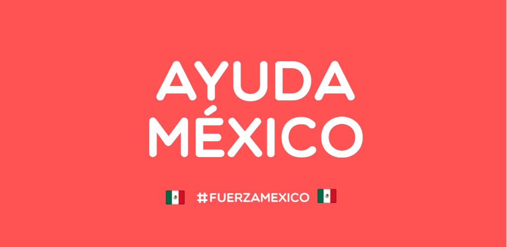

# Ayuda México

La ayuda que se necesita a donde se necesita. Todo verificado. Una comunidad civil para el alivio en momentos difíciles de nuestro país.
categories

# Sismos en México

En septiembre 2017 sismos afectaron a diferentes partes de México.

* [Septiembre 7, 2017](https://es.wikipedia.org/wiki/Terremoto_del_sureste_de_M%C3%A9xico_de_2017) con epicentro en Chiapas.
* [Septiembre 19, 2017](https://es.wikipedia.org/wiki/Terremoto_de_Puebla_de_2017) con epicentro en Puebla.

Hasta ahora los estados con más afectaciones reportadas han sido Oaxaca,
Chiapas, Ciudad de México, Tlaxcala, Puebla, Guerrero, Morelos y Michoacán.

## Sobre este repositorio

El repositorio contiene una aplicación creada a partir del sismo de Septiembre 19
2017, fue creado inicialmente para concentrar los diferentes esfuerzos de apoyo
tras el siniestro y proveer información rápidamente a quienes puedan
necesitarla.

Este proyecto podría ser usado como base para organizar una pronta respuesta en
caso de desastres posteriores.

## Ayuda México en Google Play Store

Con esta aplicación puedes encontrar todo la ayuda que necesitas:

* Hospitales
* Bancos de Sangre
* Centros de Acopio
* Visualizar en tiempo real donde se necesita ayuda
* Telefonos
* Areas Afectas en CDMX y Morelos
* Localizador de Personas 
* Avisos Importantes
* Donaciones
* Preguntas Frecuentes.

### [Aplicación Ayuda México](https://play.google.com/store/apps/details?id=io.github.erikcaffrey.ayudamexico)

### Recuerda dar like y compartir nuestra pagina en Facebook

* [AyudaMx19](https://www.facebook.com/pg/AyudaMX19)

License
-------

    Copyright 2017 Erik Jhordan Rey

    Licensed under the Apache License, Version 2.0 (the "License");
    you may not use this file except in compliance with the License.
    You may obtain a copy of the License at

       http://www.apache.org/licenses/LICENSE-2.0

    Unless required by applicable law or agreed to in writing, software
    distributed under the License is distributed on an "AS IS" BASIS,
    WITHOUT WARRANTIES OR CONDITIONS OF ANY KIND, either express or implied.
    See the License for the specific language governing permissions and
    limitations under the License.
